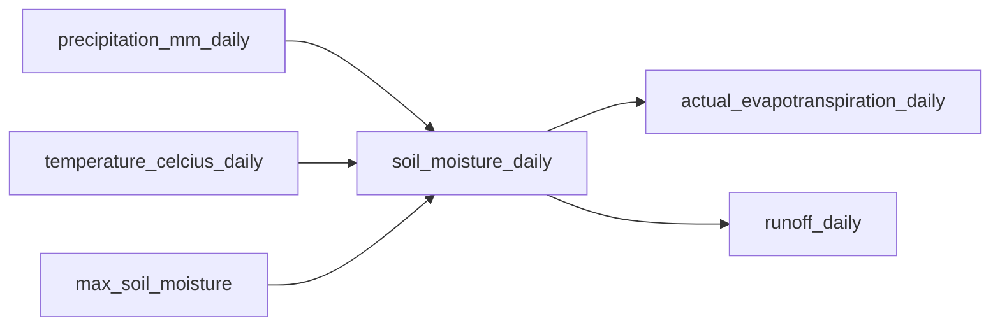

# How SatTerC Works: Directed Acyclic Graphs

At its core, SatTerC represents a pipeline as a **Directed Acyclic Graph (DAG)**.
This section explains what that means and why it matters.

## What is a DAG?

A Directed Acyclic Graph is a network of nodes connected by directed edges, with no cycles.
In SatTerC:

- **Nodes** are computations — Python functions that produce a value (typically an `xarray.DataArray`).
- **Edges** represent dependencies — if node B needs the output of node A, there is a directed edge from A to B.
- **Acyclic** means there are no circular dependencies; computation always flows forward.



In this simplified example, `soil_moisture_daily` depends on precipitation, temperature, and maximum soil moisture.
The DAG makes these dependencies explicit and machine-readable.

## Why DAGs?

### Automatic dependency resolution

You declare **what** you want (the output variables), not **how** to compute them.
The DAG engine figures out which nodes need to run and in what order.

### Lazy execution

Only the nodes required to produce your requested outputs are executed.
If you only need soil moisture, the P-Model and SGAM nodes never run.

### Reproducibility

Every output is a pure function of its inputs.
The same config and data always produce the same results.

### Composability

Models are independent modules that declare their inputs and outputs.
You can mix and match them freely — add RothC to an existing SPLASH + P-Model pipeline by adding one config section.

## How SatTerC Uses DAGs

SatTerC is built on the [Hamilton](https://github.com/dagworks-inc/hamilton) DAG framework.
Here's how the pieces fit together:

### 1. Configuration

You write a TOML config file that declares which models to run, where to load data from, and what to save:

```toml
[models.splash]

[models.pmodel]
method_kphio = "sandoval"

[inputs.daily]
path = "data/daily.nc"
vars = ["precipitation_mm", "temperature_celcius", "sunshine_fraction"]

[inputs.static]
path = "data/static.nc"
vars = ["elevation", "max_soil_moisture"]

[outputs.daily]
path = "results/daily.nc"
vars = ["actual_evapotranspiration", "soil_moisture"]
```

### 2. Build

When you run `satterc run config.toml`, SatTerC:

1. Parses the config file
2. Imports the requested model modules
3. Builds a DAG by inspecting each function's signature (parameter names = required inputs, return values = produced outputs)
4. Connects input loaders, models, resampling steps, and output savers into a single graph

### 3. Execute

The DAG engine:

1. Starts from your requested target nodes (e.g., `save_daily_outputs`)
2. Traces backwards to find all required upstream nodes
3. Executes nodes in topological order, caching results
4. Returns or saves the final outputs

### 4. Visualise

You can inspect the DAG at any time:

```bash
satterc graph config.toml --pdf
```

This produces a visual graph showing all nodes and their dependencies, colour-coded by temporal frequency.

## Nodes and Naming

Every node in the DAG has a unique name, derived from the function that produces it.
By convention, SatTerC appends a frequency suffix to distinguish temporal resolutions:

| Suffix | Meaning |
|--------|---------|
| `_daily` | Daily temporal resolution |
| `_weekly` | Weekly temporal resolution |
| `_monthly` | Monthly temporal resolution |
| (no suffix) | Static / time-invariant |

For example, `soil_moisture_daily` and `soil_moisture_weekly` are distinct nodes.
The resampling system creates edges between them (e.g., aggregating daily to weekly).

## Custom Modules

You can add your own functions to the DAG.
Any Python module that follows Hamilton conventions (functions whose parameter names match node names) can be included.
See [Custom Modules](../usage/custom-modules.md) for details.
