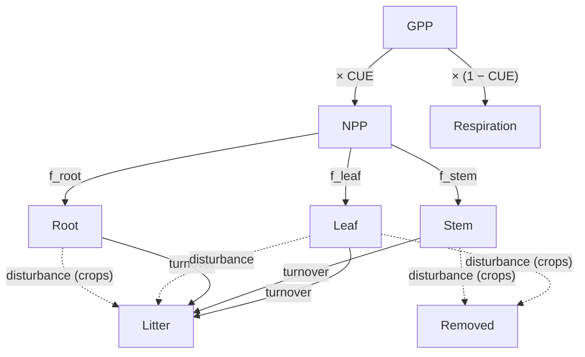

# Simplified Growth and Allocation Model (SGAM)


## Overview

SGAM is a simplified plant growth and carbon allocation model that simulates how photosynthetically-fixed carbon is distributed among plant tissues. Given weekly environmental drivers — gross primary productivity (GPP), temperature, soil moisture, vapour pressure deficit (VPD), light use efficiency (LUE), and intrinsic water use efficiency (iWUE) — it tracks carbon in leaf, stem, root, litter, and removed-by-disturbance pools for four plant functional types: tree, grass, shrub, and crop.

The model accounts for dynamic allocation, autotrophic respiration, litterfall turnover, and disturbance or harvest events, enforcing strict mass balance at every timestep.

We developed SGAM ourselves as a standalone package. See the [SGAM documentation](https://satterc.github.io/sgam/science.html) for full details.



## Theory

### Carbon Use Efficiency

The fraction of GPP retained as biomass — the Carbon Use Efficiency (CUE) — depends on LUE and iWUE, each normalised against PFT-specific maximums to produce dimensionless scores:

$$s_{\text{LUE}} = \min\left(\frac{\text{LUE}}{\text{LUE}_{\max}}, 1\right), \qquad s_{\text{iWUE}} = \min\left(\frac{\text{iWUE}}{\text{iWUE}_{\max}}, 1\right)$$

The mean score linearly scales CUE between 0.2 and 0.7:

$$\text{CUE} = \text{CUE}_{\min} + \bar{s} \cdot (\text{CUE}_{\max} - \text{CUE}_{\min}), \quad \bar{s} = \tfrac{1}{2}(s_{\text{LUE}} + s_{\text{iWUE}})$$

Net Primary Productivity is then $\text{NPP} = \text{GPP} \times \text{CUE}$, with the remainder lost as autotrophic respiration.

### Drought Modifier

Water availability constrains allocation via a drought modifier $f_{\text{drought}} \in [0, 1]$, combining:

- **Soil moisture stress** – linear scaling between wilting point and field capacity
- **VPD stress** – exponential decline above a PFT-specific threshold

The combined modifier applies Liebig's Law of the Minimum:

$$f_{\text{drought}} = \min(f_{\text{sm}},\; f_{\text{vpd}})$$

### Dynamic Allocation

NPP is split among leaf, stem, and root by allocation fractions that are dynamically adjusted from P-specific base values by three modifiers:

- **Seasonality** – sinusoidal preference for leaves peaking at the summer solstice
- **Temperature deviation** – shifts allocation toward roots below optimum, toward leaves above
- **Drought root bonus** – increases root allocation under water or atmospheric stress

The adjusted fractions are normalised to sum to 1, with minimum floors preventing biologically unrealistic values.

### Turnover and Litter

Each pool loses biomass at a fixed first-order rate each week. Losses from leaf, stem, and root accumulate in the litter pool. Mean residence times span from ~20 weeks for crop leaves to ~5000 weeks for tree wood.

### Disturbances

Disturbance events are detected from daily time series by checking simultaneous declines in GPP and LAI during the growing season. The response differs by PFT:

- **Crops** – complete removal of above-ground biomass (harvest); root carbon transfers to litter
- **Other PFTs** – partial defoliation proportional to severity (fire, grazing, pests)

### Plant Functional Type Parameters

Default parameter sets encode distinct ecological strategies:

| Parameter | Tree | Grass | Shrub | Crop |
|-----------|------|-------|-------|------|
| Leaf base allocation | 0.25 | 0.45 | 0.20 | 0.40 |
| Stem base allocation | 0.45 | 0.10 | 0.40 | 0.40 |
| Root base allocation | 0.30 | 0.45 | 0.40 | 0.20 |
| Leaf turnover (wk⁻¹) | 0.012 | 0.035 | 0.010 | 0.050 |
| Stem turnover (wk⁻¹) | 0.0002 | 0.015 | 0.002 | 0.025 |
| Root turnover (wk⁻¹) | 0.010 | 0.025 | 0.010 | 0.030 |
| LUE_max (gC MJ⁻¹) | 2.5 | 3.0 | 2.2 | 4.2 |
| iWUE_max (μmol mol⁻¹) | 450 | 350 | 650 | 300 |
| VPD threshold (Pa) | 800 | 500 | 1200 | 400 |
| Wilting point (m³ m⁻³) | 0.12 | 0.08 | 0.05 | 0.15 |
| Field capacity (m³ m⁻³) | 0.35 | 0.30 | 0.25 | 0.40 |

Trees invest heavily in long-lived structural carbon; grasses prioritise rapid leaf and root turnover; shrubs are drought-tolerant with high water-use efficiency; crops are optimised for above-ground productivity.

### Mass Balance

At each timestep carbon is conserved across all live pools:

$$P_{\text{pool}}(t) = P_{\text{pool}}(t-1) + \text{NPP}_{\text{pool}}(t) - \Delta P_{\text{pool}}^{\text{turn}}(t) - \Delta P_{\text{pool}}^{\text{dist}}(t)$$

Any violation beyond a relative tolerance of $10^{-6}$ indicates a numerical error.

## Usage

### Configuration

SGAM is configured in your TOML config file:

```toml
[models.sgam]
use_dynamic_allocation = true
strict_mass_balance = false
```

| Parameter | Default | Description |
|-----------|---------|-------------|
| `use_dynamic_allocation` | true | If true, allocation fractions vary with environmental conditions; if false, use fixed base allocations |
| `strict_mass_balance` | false | If true, raise an error on mass balance violation; if false, issue a warning |

### Required inputs

SGAM requires the following weekly `DataArray` inputs:

| Variable | Units | Description |
|----------|-------|-------------|
| `temperature_celcius_weekly` | °C | Weekly mean air temperature |
| `gpp_weekly` | gC m⁻² wk⁻¹ | Gross primary productivity |
| `soil_moisture_weekly` | mm | Soil moisture content |
| `vpd_pa_weekly` | Pa | Vapour pressure deficit |
| `lue_weekly` | gC MJ⁻¹ | Light use efficiency |
| `iwue_weekly` | Pa | Intrinsic water use efficiency |
| `disturbances_weekly` | dimensionless (0–1) | Weekly disturbance severity |

And the following static `DataArray` inputs:

| Variable | Units | Description |
|----------|-------|-------------|
| `plant_type` | dimensionless (0–3) | Plant functional type (0=tree, 1=grass, 2=shrub, 3=crop) |
| `latitude` | degrees | Site latitude (determines hemisphere for seasonality) |
| `leaf_pool_init` | gC m⁻² | Initial leaf carbon pool |
| `stem_pool_init` | gC m⁻² | Initial stem carbon pool |
| `root_pool_init` | gC m⁻² | Initial root carbon pool |

Optional static inputs:

| Variable | Units | Description |
|----------|-------|-------------|
| `litter_pool_init` | gC m⁻² | Initial litter pool (default: 0) |
| `removed_init` | gC m⁻² | Initial removed-carbon pool (default: 0) |

### Disturbance detection

SGAM includes helper nodes to detect disturbances from daily data:

```toml
[models.sgam]
```

The `disturbances_daily` node computes daily disturbance events from temperature, GPP, and LAI, then `disturbances_weekly` aggregates to weekly maximum severity.

### Outputs

SGAM returns 23 weekly `DataArray` outputs:

**Pool sizes** (gC m⁻²):

| Variable | Description |
|----------|-------------|
| `leaf_pool_weekly` | Leaf carbon pool |
| `stem_pool_weekly` | Stem carbon pool |
| `root_pool_weekly` | Root carbon pool |
| `litter_pool_weekly` | Litter carbon pool |
| `removed_pool_weekly` | Carbon removed by disturbance (e.g., harvest) |

**NPP fluxes** (gC m⁻² wk⁻¹):

| Variable | Description |
|----------|-------------|
| `npp_leaf_weekly` | NPP allocated to leaves |
| `npp_stem_weekly` | NPP allocated to stems |
| `npp_root_weekly` | NPP allocated to roots |

**Turnover fluxes** (gC m⁻² wk⁻¹):

| Variable | Description |
|----------|-------------|
| `turnover_leaf_weekly` | Leaf litterfall |
| `turnover_stem_weekly` | Stem litterfall |
| `turnover_root_weekly` | Root litterfall |

**Respiration fluxes** (gC m⁻² wk⁻¹):

| Variable | Description |
|----------|-------------|
| `respiration_leaf_weekly` | Leaf autotrophic respiration |
| `respiration_stem_weekly` | Stem autotrophic respiration |
| `respiration_root_weekly` | Root autotrophic respiration |

**Disturbance fluxes** (gC m⁻² wk⁻¹):

| Variable | Description |
|----------|-------------|
| `disturbance_leaf_weekly` | Leaf carbon lost to disturbance |
| `disturbance_stem_weekly` | Stem carbon lost to disturbance |
| `disturbance_root_weekly` | Root carbon lost to disturbance |

**Diagnostics** (dimensionless):

| Variable | Description |
|----------|-------------|
| `cue_weekly` | Carbon use efficiency |
| `allocation_leaf_weekly` | Fraction of NPP to leaves |
| `allocation_stem_weekly` | Fraction of NPP to stems |
| `allocation_root_weekly` | Fraction of NPP to roots |
| `drought_modifier_weekly` | Drought stress modifier |
| `lue_score_weekly` | Normalised LUE score |
| `iwue_score_weekly` | Normalised iWUE score |

### Derived outputs

A helper node computes leaf area index from the leaf carbon pool:

$$\text{LAI} = \frac{\text{leaf\_pool}}{\text{leaf\_carbon\_area}}$$

### Python API

See the [API documentation](../api/satterc.dag/sgam.md) for full function signatures and parameter details.

## References

SGAM was developed internally by the SatTerC team. For the full scientific background and implementation details, see the [SGAM documentation](https://satterc.github.io/sgam/science.html).
