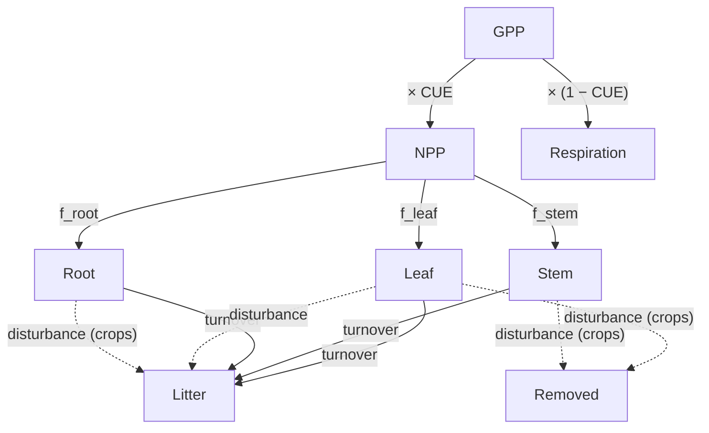

# Simplified Growth and Allocation Model (SGAM)


## Overview

SGAM is a simplified plant growth and carbon allocation model that simulates how photosynthetically-fixed carbon is distributed among plant tissues. It takes weekly environmental drivers (gross primary productivity, temperature, soil moisture, vapour pressure deficit, light use efficiency and intrinsic water use efficiency) and tracks carbon in leaf, stem, root, litter and removed-by-disturbance pools, for four plant functional types: tree, grass, shrub and crop.

Allocation varies with conditions, and the model also handles autotrophic respiration, litterfall turnover, and disturbance or harvest events. Mass balance is checked at every timestep.

We wrote SGAM ourselves as a standalone package. See the [SGAM documentation](https://satterc.github.io/sgam/science.html) for full details.

Carbon flows through the pools like this:


```mermaid
flowchart TD
    GPP["GPP"]
    NPP["NPP"]
    RESP["Respiration"]
    LEAF["Leaf"]
    STEM["Stem"]
    ROOT["Root"]
    LIT["Litter"]
    REM["Removed"]

    GPP -- "× CUE" --> NPP
    GPP -- "× (1 − CUE)" --> RESP

    NPP -- "f_leaf" --> LEAF
    NPP -- "f_stem" --> STEM
    NPP -- "f_root" --> ROOT

    LEAF -- "turnover" --> LIT
    STEM -- "turnover" --> LIT
    ROOT -- "turnover" --> LIT

    LEAF -. "disturbance" .-> LIT
    LEAF -. "disturbance (crops)" .-> REM
    STEM -. "disturbance (crops)" .-> REM
    ROOT -. "disturbance (crops)" .-> LIT
```

The DAG for a pipeline running SGAM alone, with the dashed clusters grouping nodes by declared frequency (`7D` for weekly, `D` for daily). It is a large graph — 24 outputs — so it scrolls inside its box:

<div class="model-graph">
--8<-- "docs/models/_graphs/sgam.svg"
</div>

## Theory

### Carbon use efficiency

The fraction of GPP retained as biomass — the Carbon Use Efficiency (CUE) — depends on LUE and iWUE, each normalised against PFT-specific maximums to produce dimensionless scores:

$$s_{\text{LUE}} = \min\left(\frac{\text{LUE}}{\text{LUE}_{\max}}, 1\right), \qquad s_{\text{iWUE}} = \min\left(\frac{\text{iWUE}}{\text{iWUE}_{\max}}, 1\right)$$

The mean score linearly scales CUE between 0.2 and 0.7:

$$\text{CUE} = \text{CUE}_{\min} + \bar{s} \cdot (\text{CUE}_{\max} - \text{CUE}_{\min}), \quad \bar{s} = \tfrac{1}{2}(s_{\text{LUE}} + s_{\text{iWUE}})$$

Net Primary Productivity is then $\text{NPP} = \text{GPP} \times \text{CUE}$, with the remainder lost as autotrophic respiration.

### Drought modifier

Water availability constrains allocation via a drought modifier $f_{\text{drought}} \in [0, 1]$, combining:

- **Soil moisture stress** – linear scaling between wilting point and field capacity
- **VPD stress** – exponential decline above a PFT-specific threshold

The combined modifier applies Liebig's Law of the Minimum:

$$f_{\text{drought}} = \min(f_{\text{sm}},\; f_{\text{vpd}})$$

### Dynamic allocation

NPP is split among leaf, stem, and root by allocation fractions that are dynamically adjusted from PFT-specific base values by three modifiers:

- **Seasonality** – sinusoidal preference for leaves peaking at the summer solstice
- **Temperature deviation** – shifts allocation toward roots below optimum, toward leaves above
- **Drought root bonus** – increases root allocation under water or atmospheric stress

The adjusted fractions are normalised to sum to 1, with minimum floors preventing biologically unrealistic values.
Setting `use_dynamic_allocation = false` skips all three and uses the PFT's base fractions unchanged.

### Turnover and litter

Each pool loses biomass at a fixed first-order rate each week. Losses from leaf, stem, and root accumulate in the litter pool. Mean residence times span from ~20 weeks for crop leaves to ~5000 weeks for tree wood.

### Disturbances

Disturbance events are detected from daily time series by checking simultaneous declines in GPP and LAI during the growing season. Detection is per-PFT: the decline must exceed that PFT's `disturbance_threshold` (tree 0.3, shrub 0.25, grass 0.2, crop 0.1), so crops flag events that leave a tree pixel untouched. The response also differs by PFT:

- **Crops** – complete removal of above-ground biomass (harvest); root carbon transfers to litter
- **Other PFTs** – partial defoliation proportional to severity (fire, grazing, pests)

### Plant functional type parameters

SGAM ships one parameter set per PFT. The values below are its defaults; we have not calibrated them or traced each number to a source, so treat them as a starting point rather than as recommended values.

| Parameter | Tree | Grass | Shrub | Crop |
|-----------|------|-------|-------|------|
| Leaf base allocation | 0.25 | 0.45 | 0.20 | 0.40 |
| Stem base allocation | 0.45 | 0.10 | 0.40 | 0.40 |
| Root base allocation | 0.30 | 0.45 | 0.40 | 0.20 |
| Leaf turnover (wk⁻¹) | 0.012 | 0.035 | 0.010 | 0.050 |
| Stem turnover (wk⁻¹) | 0.0002 | 0.015 | 0.002 | 0.025 |
| Root turnover (wk⁻¹) | 0.010 | 0.025 | 0.010 | 0.030 |
| LUE_max (gC MJ⁻¹) | 2.5 | 3.0 | 2.2 | 4.2 |
| iWUE_max (μmol mol⁻¹) | 450 | 350 | 650 | 300 |
| VPD threshold (Pa) | 800 | 500 | 1200 | 400 |
| Wilting point (m³ m⁻³) | 0.12 | 0.08 | 0.05 | 0.15 |
| Field capacity (m³ m⁻³) | 0.35 | 0.30 | 0.25 | 0.40 |

The pattern in those numbers is the intended one: trees hold carbon in long-lived structure, grasses turn leaves and roots over fast, shrubs tolerate drought at high water-use efficiency, crops put carbon above ground.

These are not pipeline config: they come from the `sgam` package, keyed on each pixel's `plant_type`, via the `pft_params` node.

### Mass balance

At each timestep carbon is conserved across all live pools:

$$P_{\text{pool}}(t) = P_{\text{pool}}(t-1) + \text{NPP}_{\text{pool}}(t) - \Delta P_{\text{pool}}^{\text{turn}}(t) - \Delta P_{\text{pool}}^{\text{dist}}(t)$$

A violation beyond a relative tolerance of $10^{-6}$ means something is wrong; `strict_mass_balance` decides whether that raises or warns.

## Usage

### Quickstart

```sh
satterc setup --models sgam --defaults
satterc data-gen config.toml --grid 1 1 --duration 2y --seed 42
satterc run config.toml
```

The [quickstart](../guides/quickstart.md) walks through what each of those does, and how to point the config at your own data instead of the synthetic set.
For tuning the per-PFT parameters against observations, see the [PFT parameters recipe](../recipes/pft_parameters.md).

### Configuration

```toml
[sgam]
_import_path = "satterc.models.sgam"
use_dynamic_allocation = true
strict_mass_balance = false
```

::: satterc.models.sgam.sgam_config
    options:
      show_root_heading: false
      show_root_toc_entry: false
      show_signature: false
      show_docstring_description: false
      show_docstring_returns: false
      docstring_section_style: spacy

Disturbance detection has one setting of its own, configured as a key of the same `[sgam]` section:

::: satterc.models.sgam.disturbances_config
    options:
      show_root_heading: false
      show_root_toc_entry: false
      show_signature: false
      show_docstring_description: false
      show_docstring_returns: false
      docstring_section_style: spacy

### Inputs

::: satterc.models.sgam.sgam
    options:
      show_root_heading: false
      show_root_toc_entry: false
      show_signature: false
      show_docstring_description: false
      show_docstring_returns: false
      docstring_section_style: spacy

Two of those inputs are produced by this module rather than loaded:

::: satterc.models.sgam.pft_params
    options:
      show_root_heading: true
      show_root_full_path: false
      show_root_toc_entry: false
      show_signature: false
      separate_signature: false
      show_docstring_returns: false
      heading_level: 4
      docstring_section_style: spacy

::: satterc.models.sgam.disturbances_daily
    options:
      show_root_heading: true
      show_root_full_path: false
      show_root_toc_entry: false
      show_signature: false
      separate_signature: false
      show_docstring_returns: false
      heading_level: 4
      docstring_section_style: spacy

`disturbances_weekly` is the daily severity aggregated to a weekly maximum, which the generated config does with a `[[resample]]` entry.

### Outputs

::: satterc.models.sgam.SgamOut
    options:
      show_root_heading: false
      show_root_toc_entry: false
      show_docstring_description: false
      docstring_section_style: spacy
      show_bases: false
      members: false

Leaf area index is not one of them.
`recipes/config.toml` derives `leaf_area_index_weekly` in a `[[node]]`, as `leaf_pool_weekly / pft_params["leaf_carbon_area"]`.

### Python API

See the [API documentation](../reference/modules/satterc.models/sgam.md) for full function signatures and parameter details.

## References

SGAM was developed internally by the SatTerC team. For the full scientific background and implementation details, see the [SGAM documentation](https://satterc.github.io/sgam/science.html).
